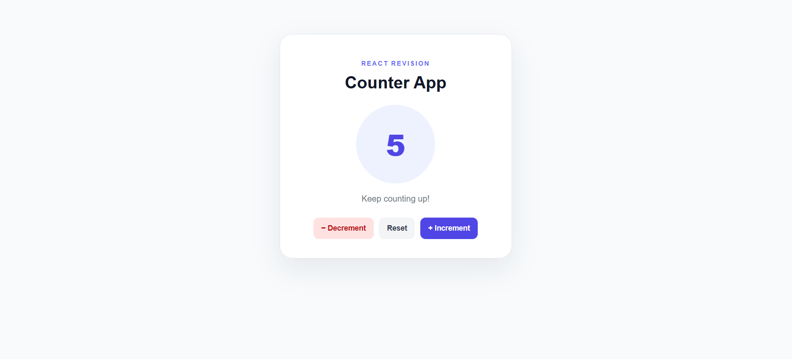

# React Counter App

## Preview




A simple and responsive Counter App built using React and Vite. This project was created as part of my React revision to practice React fundamentals.

## Features

* Increment the counter
* Decrement the counter
* Reset the counter to zero
* Dynamic messages based on the counter value
* Responsive layout
* Functional state updates using React's `useState` hook

## Tech Stack

* React
* JavaScript (ES6+)
* CSS3
* Vite

## Project Structure

```text
Counter-react-app/
├── public/
├── src/
│   ├── assets/
│   ├── CounterApp/
│   │   ├── CounterApp.jsx
│   │   └── CounterApp.css
│   ├── App.jsx
│   ├── index.css
│   └── main.jsx
├── .gitignore
├── eslint.config.js
├── index.html
├── package.json
├── package-lock.json
├── README.md
└── vite.config.js
```

## Getting Started

### 1. Clone the repository

```bash
git clone YOUR_REPOSITORY_URL
```

### 2. Navigate to the project directory

```bash
cd Counter-react-app
```

### 3. Install dependencies

```bash
npm install
```

### 4. Start the development server

```bash
npm run dev
```

## What I Practiced

* Creating reusable React components
* Managing state with `useState`
* Handling click events with `onClick`
* Updating state using functional updates
* Organizing component-specific and global CSS

## Purpose

This project is part of my ongoing React revision and frontend development practice.


---

## 🛠️ Tech Stack

**Frontend**

<p>
  
  &nbsp;&nbsp;
  
  &nbsp;&nbsp;
  
  &nbsp;&nbsp;
  
</p>

---

## 🤝 Connect with Me

If you have any questions or would like to connect, feel free to reach out through the platforms below.

**LinkedIn**

<a href="https://www.linkedin.com/in/sajjadali-fullstack/">
  
</a>

**Gmail**

<a href="mailto:sajjadali.dev01@gmail.com">
  
</a>

---

## 💖 Support & Usage

If you find this project helpful, please consider:

1. Giving the repository a **Star ⭐**
2. Sharing feedback or suggestions
3. Giving credit if you use this project as a learning reference

